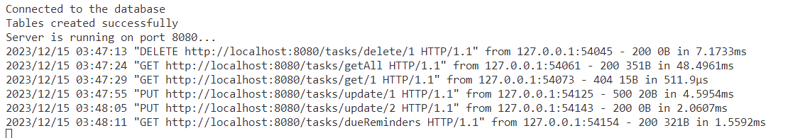
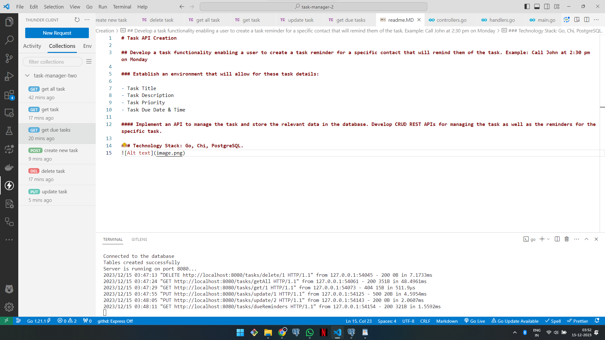
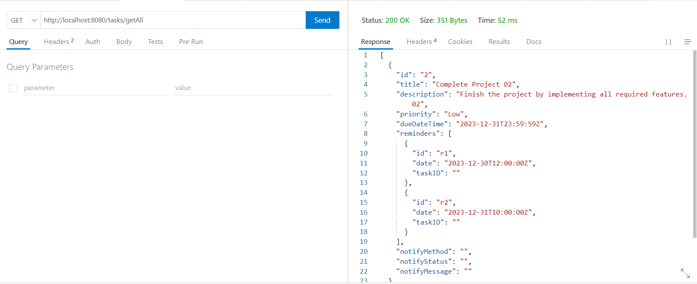
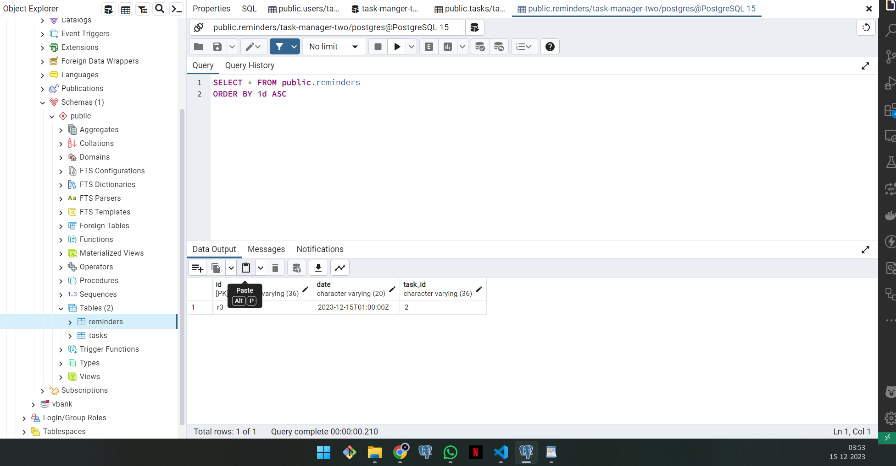
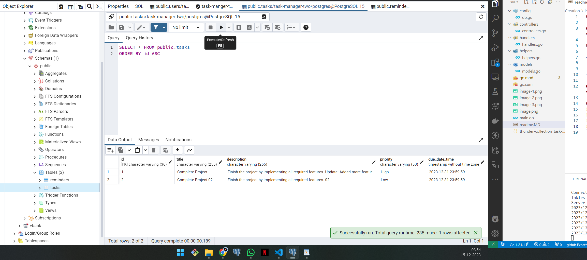
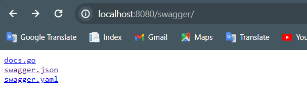

# Task API Creation

## Develop a task functionality enabling a user to create a task reminder for a specific contact that will remind them of the task. Example: Call John at 2:30 pm on Monday

### Establish an environment that will allow for these task details:

- Task Title
- Task Description
- Task Priority
- Task Due Date & Time

#### Implement an API to manage the task and store the relevant data in the database. Develop CRUD REST APIs for managing the task as well as the reminders for the specific task.

### Technology Stack: Go, Chi, PostgreSQL.

# to access the swagger api documentation

1. run the application

then use tools like wget or curl to download the Swagger JSON file from server.

or paste this link to web browser : http://localhost:8080/swagger/
